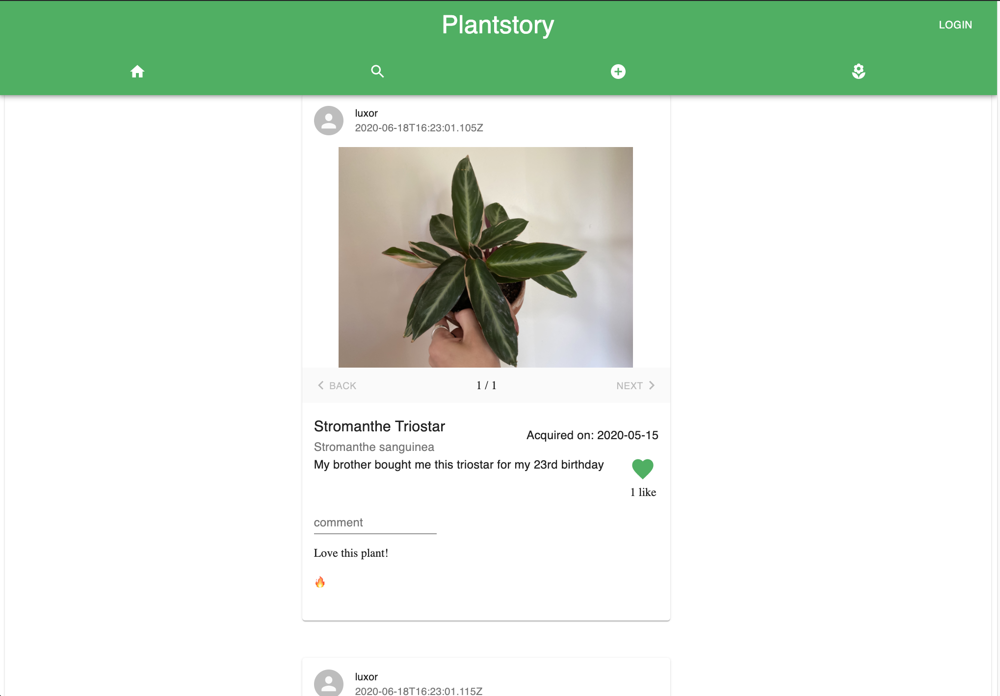

# Plantstory API

A __Ruby on Rails__ API following MVC patterns using __Postgress__. Used as the backend for [Plantsory_client](https://github.com/jguzz/plantstory-client).
Uses __active storage__ for photo storage.

## Installation 
* Clone down the repo using `git clone https://github.com/jguzz/Plantstory_api.git`
Run... 
* `bundle install`
* `rails db:create`
* `rails db:migrate`
* `rails db:seed`
* `rails s`

Now you can use the [Plantstory Client](https://github.com/jguzz/plantstory-client) to see all Plantstories in the API!

## Demo 

A video demo of the Plantstory application can be found [here](https://youtu.be/SrtUxy3YXQA)!

## Credits
Code written by Joseph A Guzzardo
- [LinkedIn](https://www.linkedin.com/in/joseph-a-guzzardo/)
- [Github](https://github.com/jguzz)
- [Email](https://mail.google.com/mail/u/0/?view=cm&fs=1&tf=1&source=mailto&to=joseph.a.guzzardo@gmail.com)

## Contribute 
To contribute to Plantstory, follow these steps:
- Fork this repository.
- Create a branch: `git checkout -b <branch_name>`
- Make your changes and commit them: `git commit -m '[commit_message]'`
- Push to the original branch: `git push origin [project_name]/[location]`
- Create the pull request.

Alternatively see the GitHub documentation on [creating a pull request](https://help.github.com/en/github/collaborating-with-issues-and-pull-requests/creating-a-pull-request).

## MIT License

Copyright (c) [2020] [Joseph A Guzzardo]

Permission is hereby granted, free of charge, to any person obtaining a copy
of this software and associated documentation files (the "Software"), to deal
in the Software without restriction, including without limitation the rights
to use, copy, modify, merge, publish, distribute, sublicense, and/or sell
copies of the Software, and to permit persons to whom the Software is
furnished to do so, subject to the following conditions:

The above copyright notice and this permission notice shall be included in all
copies or substantial portions of the Software.

THE SOFTWARE IS PROVIDED "AS IS", WITHOUT WARRANTY OF ANY KIND, EXPRESS OR
IMPLIED, INCLUDING BUT NOT LIMITED TO THE WARRANTIES OF MERCHANTABILITY,
FITNESS FOR A PARTICULAR PURPOSE AND NONINFRINGEMENT. IN NO EVENT SHALL THE
AUTHORS OR COPYRIGHT HOLDERS BE LIABLE FOR ANY CLAIM, DAMAGES OR OTHER
LIABILITY, WHETHER IN AN ACTION OF CONTRACT, TORT OR OTHERWISE, ARISING FROM,
OUT OF OR IN CONNECTION WITH THE SOFTWARE OR THE USE OR OTHER DEALINGS IN THE
SOFTWARE.
